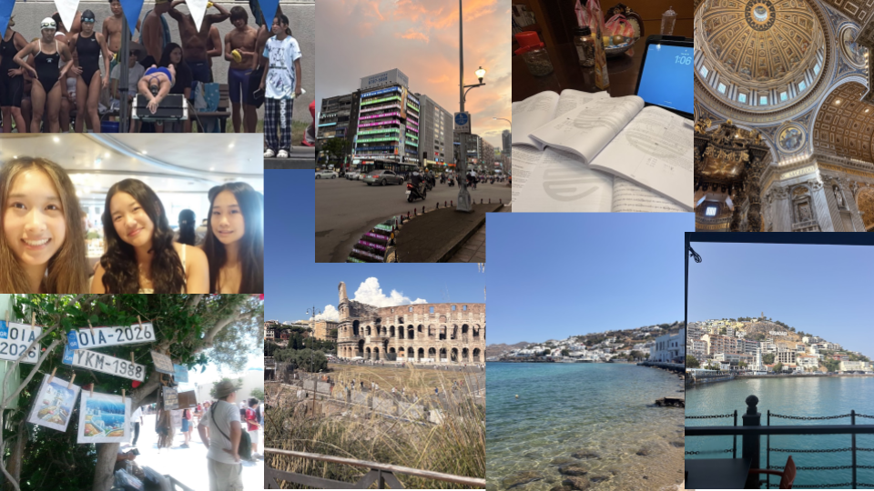

# me-in-markdown

### Introduction Letter

My name is Hannah and I am currently in tenth grade at Chatsworth Charter High School. I was born on August 11, 2011 and I have a younger brother named Caden. One goal I have for this school year is to get a 4.0 GPA and pass with a 3 or higher on all of my AP tests. Another goal that I have for this school year is to try to make varsity for soccer. The two sports that I mainly do is swim and soccer. I am on a swim team, and for soccer, I'm on the high school team, and I practice alone at home.

This summer, I first went to Europe for a cruise. I was on the cruise with my family and my family friends, and we went to these few places:
1. **Mykonos**
2. **Santorini**
3. **Ephesus**
4. **Rome**
5. **Naples**

After the cruise, we stayed at Rome to visit some iconic places such as the Colosseum, Saint Peter's Basilica etc. Then, me, my mom, and my brother flew to Taiwan. There, I did a SAT class for 3 weeks with my friend and visited some family. After the three weeks, I flew back to America alone with my friend, and we went to our swim *championships* competition, participating in relays.

My favorite summer memory with my friends is when they surprised me for my birthday and we had fun at the country club together swimming. Something that made this special was that they planned this all by themselves and kept it a surprise from me and we had a lot of fun doing something so simple.

Some of my personal achievements is getting to the highest level in my piano and finishing with almost State Honors every year. Another one of my personal achievements is qualifying for different swim championships and medaling in different events.

Playlist:

[Me in Markdown Playlist](https://open.spotify.com/playlist/1ExfChn3O7B9lr8mzgk6bt?si=bJTI8lajRDyfd4Af3Pya-w&utm_source=copy-link&pi=3aiozARyQOyvo)

Collage:

